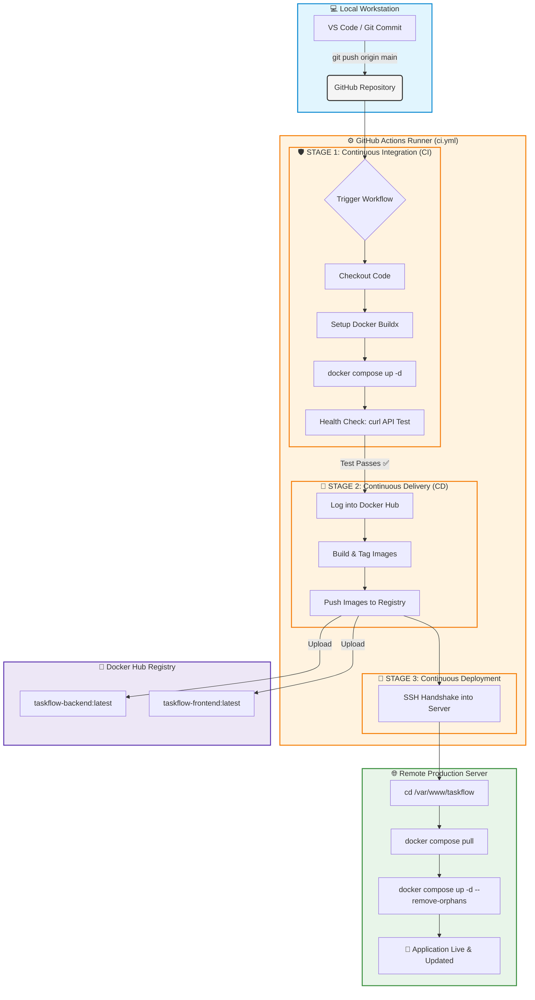

# Welcome to Docker

This is a repo for new users getting started with Docker.

You can try it out using the following command.
```
docker run -d -p 8088:80 --name welcome-to-docker docker/welcome-to-docker
```
And open `http://localhost:8088` in your browser.

# Building

Maintainers should see [MAINTAINERS.md](MAINTAINERS.md).

Build and run:
```
docker build -t welcome-to-docker . 
docker run -d -p 8088:3000 --name welcome-to-docker welcome-to-docker
```
Open `http://localhost:8088` in your browser.
# 📋 TaskFlow Management System

TaskFlow is a modern, containerized full-stack web application designed for efficient task tracking. The project leverages an automated DevOps CI/CD pipeline for safe, automated production deployments.

---

## 🛠️ Technology Stack

### 🔹 Frontend (User Interface)
*    **React.js** – Component-driven interface library.
*    **Vite** – Next-generation, ultra-fast frontend tooling and bundler.
*    **HTML5 & CSS3** – Standard markup and custom UI variables.
*    **Nginx** – High-performance production server used to distribute static assets.

### 🔹 Backend (API & Logic)
*    **Node.js** – Server-side JavaScript runtime engine.
*    **Express.js** – Minimalist web framework for creating RESTful API endpoints.
*   **Mongoose (ODM)** – Object Data Modeling library used to structure database queries safely.

### 🔹 Database (Storage)
*  **MongoDB** – Flexible, document-based NoSQL database engine.

### 🔹 DevOps & Infrastructure (CI/CD)
*    **Docker & Docker Compose** – Container blueprints and multi-service environment orchestrator.
*    **GitHub Actions** – Automated server runners for continuous pipeline execution.
*   **Docker Hub** – Cloud image registry hosting final distribution artifacts.
*   **SSH Protocol** – Encrypted remote connection framework powering automated deployment commands.

---

## 📊 CI/CD Architecture & Deployment Pipeline

The diagram below represents the automated code pipeline triggered on every `git push` to the `main` branch.



---

## 🚀 Quick Start Guide

### Running Locally
To launch the entire full-stack project locally without installing local software dependencies, simply run:

```bash
docker compose up -d --build
```
*   **Frontend Access:** `http://localhost:5173`
*   **Backend Access:** `http://localhost:5000`
